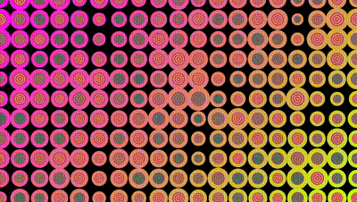

# Artistic Animation with Perlin Noise

The provided code demonstrates a visual art piece generated using p5.js, featuring an array of circles arranged in a visually appealing pattern. The animation employed Perlin noise to create a subtle, continuous transformation of the collective image.

By leveraging Perlin noise, the animation effect is achieved by using the noise() function in p5.js, which generates smooth and organic fluctuations. These fluctuations alter the position of the elements over time, resulting in an intriguing and evolving visual composition.

Each circle in the artwork is influenced by the Perlin noise, allowing them to move in a fluid, continuous manner within the canvas. The movement creates a dynamic and organic feel to the overall pattern, offering an animated effect that continuously shifts and evolves.

